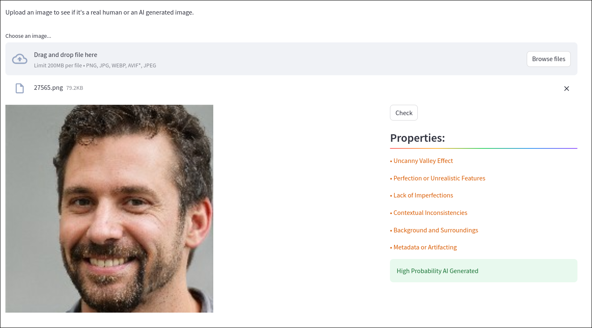
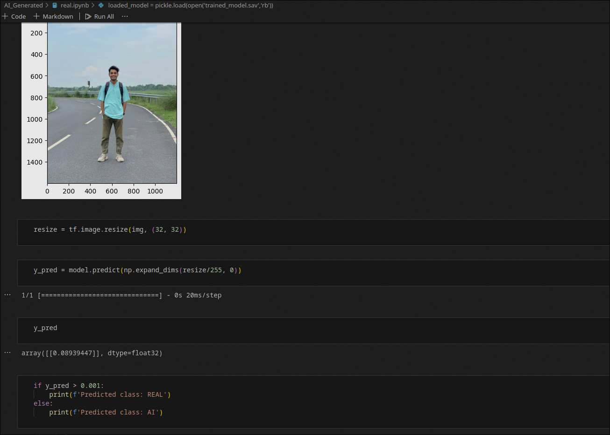

# 🧠 AI Generated Image Detector  

A machine learning–powered web application that detects whether an image is **AI-generated or real**. Built using **Streamlit**, **Convolutional Neural Networks (CNNs)**, and activation functions such as **ReLU** and **Sigmoid**, the model is fine-tuned for high accuracy and minimal false predictions.  

## 🚀 Features  

- 🔍 **AI vs Real Image Detection** – Classifies uploaded images as *real* or *AI-generated*.  
- 🧠 **Deep Learning Model** – CNN-based model trained on a dataset of **500,000 images** (250K real + 250K AI-generated).  
- 🧩 **Streamlit Interface** – Simple, intuitive, and user-friendly web interface for seamless interaction.  
- 📹 **Future Extension** – Prototype support for *AI-generated video detection*.  
- 📬 **Contact and About Pages** – Integrated contact form and contributor information.  

---

## 🧑‍💻 Tech Stack  

| Component | Technology |
|------------|-------------|
| **Frontend** | Streamlit |
| **Backend** | TensorFlow / Keras |
| **Model Type** | CNN with ReLU & Sigmoid activations |
| **Serialization** | Pickle |
| **Libraries Used** | NumPy, OpenCV, TensorFlow, Pillow, Streamlit, HuggingFace Hub |

---
